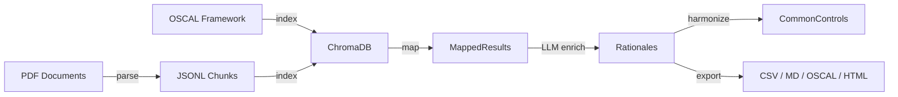

# Architecture

ctrlmap operates as a **four-stage pipeline** that maps organizational policies to security framework controls using local AI inference.

```
┌──────────┐     ┌──────────┐     ┌──────────┐     ┌─────────────┐
│  Parse   │────▶│  Index   │────▶│   Map    │────▶│  Harmonize  │
│          │     │          │     │          │     │             │
│ PDF→JSONL│     │ Embed→DB │     │ RAG+LLM  │     │  Cluster    │
└──────────┘     └──────────┘     └──────────┘     └─────────────┘
```

## Stages

### 1. Parse (`ctrlmap.parse`)

Extracts text from PDF documents, preserving layout structure.

- **`extractor.py`** — PyMuPDF-based text extraction with bounding-box data (`TextBlock`)
- **`heuristics.py`** — Layout detection (single-column, dual-column, table) and element classification (header, footer, body)
- **`chunker.py`** — Hybrid structural + semantic chunking with boilerplate detection and sentence healing
- **`llm_chunker.py`** — Alternative LLM-based control extraction via Ollama
- **`parse_command.py`** — CLI wiring

**Output:** `.jsonl` of `ParsedChunk` objects.

### 2. Index (`ctrlmap.index`)

Embeds text and stores vectors locally.

- **`embedder.py`** — Sentence-Transformers embedding (`all-MiniLM-L6-v2`)
- **`vector_store.py`** — ChromaDB `PersistentClient` wrapper
- **`query.py`** — Vector similarity search with embedding
- **`index_command.py`** — CLI wiring

**Output:** Populated ChromaDB database.

### 3. Map (`ctrlmap.map`)

Matches controls to supporting evidence via RAG, then enriches with LLM analysis.

- **`mapper.py`** — Core mapping: query expansion → batch embedding → vector search → min-score filtering (`top_k=5`, `min_score=0.50`)
- **`enrichment.py`** — Streaming per-control async pipeline: merged relevance+rationale → meta-classify (7B, only unmapped) → gap rationale (7B, async) → resolve. Dual-model architecture: 14B for accuracy-critical evaluation, 7B for simple tasks.
- **`meta_requirements.py`** — Governance/documentation meta-requirement classification
- **`map_command.py`** — CLI wiring + format dispatch via `_FORMAT_REGISTRY`. Supports `--concurrency` and `--cache` flags.
- **`expansion_map.json`** — Domain synonym data for query expansion

**Performance:** Merged relevance+rationale prompt halves LLM calls per chunk. Model tiering (14B rationale, 7B meta/gap) doubles throughput for simple tasks. Batch embedding, concurrent `asyncio`, and optional SQLite cache (`--cache`) provide further gains. Embedder uses `@functools.cache` to share the model across pipeline stages.

**Output:** `MappedResult` objects with rationales.

### 4. Harmonize (`ctrlmap.map.cluster`)

Deduplicates overlapping controls across frameworks.

- **`cluster.py`** — Single-linkage clustering via cosine similarity + Union-Find

**Output:** `CommonControl` objects with source references.

## Supporting Modules

| Module | Responsibility |
|--------|----------------|
| `ctrlmap.models.schemas` | Pydantic V2 data models (`ParsedChunk`, `SecurityControl`, `MappedResult`, etc.) |
| `ctrlmap.models.oscal` | OSCAL JSON catalog parser |
| `ctrlmap.llm.client` | Ollama client with async support, transparent cache integration |
| `ctrlmap.llm.structured_output` | LLM response → `MappingRationale \| InsufficientEvidence` |
| `ctrlmap.llm._json_utils` | Shared JSON extraction utilities for LLM responses |
| `ctrlmap.llm.cache` | SQLite-backed LLM response cache (wired into `call_llm_async`) |
| `ctrlmap.llm.prompts/` | Externalized prompt templates (`.txt` files) including merged relevance+rationale |
| `ctrlmap.export.*` | Output formatters (CSV, Markdown, OSCAL, HTML) |
| `ctrlmap.eval_command` | CLI subcommand for the RAG evaluation harness |
| `ctrlmap.eval_ragas` | RAGAS integration for retrieval quality metrics |
| `ctrlmap._defaults` | Centralized default constants (`DEFAULT_LLM_MODEL`, `DEFAULT_FAST_MODEL`) |
| `ctrlmap._console` | Shared Rich console instances |

## Data Flow



## Design Principles

- **Local-first:** All processing (LLM, embeddings, vector store) runs locally. No data leaves the machine.
- **Pipeline architecture:** Clear stage boundaries with serializable intermediate outputs (JSONL, ChromaDB).
- **Pydantic V2 strict mode:** `extra='forbid'` and `strict=True` on all core data models for data integrity.
- **Test-driven:** Red-Green-Refactor on every feature. Unit, integration, and LLM evaluation test suites.
