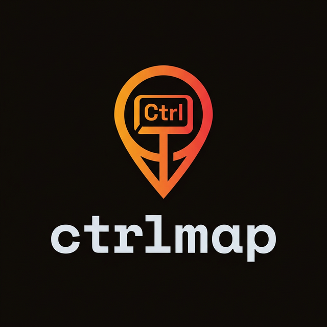
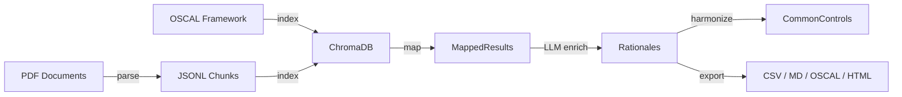

<p align="center">
  
</p>

<p align="center">
  <a href="https://github.com/JoshDoesIT/ctrlmap/actions/workflows/ci.yml"></a>
  <a href="https://www.python.org/"></a>
  <a href="https://github.com/JoshDoesIT/ctrlmap/blob/main/LICENSE"></a>
  <a href="https://github.com/astral-sh/ruff"></a>
  <a href="https://github.com/JoshDoesIT/ctrlmap"></a>
  <a href="https://mypy-lang.org/"></a>
</p>

<p align="center">
  GRC automation CLI utility that maps internal policies to security frameworks (e.g., NIST 800-53, PCI DSS, SOC 2, ISO 27001) using local AI. Zero data leaves your machine.
</p>

## Overview

`ctrlmap` is an open-source, fully local CLI tool designed for automated GRC (Governance, Risk, and Compliance) mapping. It leverages:

- **Local document parsing:** layout-aware PDF extraction via PyMuPDF
- **Embedded vector databases:** ChromaDB for semantic similarity search
- **Local LLM execution:** Ollama integration for rationale generation

### Core Capability: Control Harmonization

Ingest multiple overlapping policy and standard documents, deduplicate their requirements, and generate a unified common control set mapped back to the original source texts. "Test once, comply many."

## Installation

```bash
# Recommended: install in an isolated environment
pipx install ctrlmap
# or
uv tool install ctrlmap
```

## Quick Start (Development)

```bash
# One-command setup: installs Python deps, Ollama, and qwen2.5:14b model
make setup

# Run all tests
make test

# Run evaluation tests (requires Ollama)
make test-eval
```

See `make help` for all available targets.

## Demo

Run the full pipeline end-to-end with sample policy documents and two frameworks (NIST 800-53 + PCI DSS v4.0.1):

```bash
# One command — parses PDFs, indexes, maps with LLM rationale, harmonizes
make demo
```

This generates output in `demo/output/`:

| File | Description |
|------|-------------|
| `*_chunks.jsonl` | Parsed and chunked policy text |
| `demo_db/` | ChromaDB vector store |
| `nist_mapping.md` | NIST 800-53 control mappings with rationale |
| `pci_mapping.md` | PCI DSS v4.0.1 control mappings with rationale |
| `harmonized_controls.json` | Deduplicated common controls across both frameworks |

> **Requires:** Ollama with `qwen2.5:14b` model (~8 GB). Run `make setup` first if needed.

## CLI Commands

| Command | Purpose |
|---------|---------|
| `ctrlmap parse` | Extract and chunk PDF documents |
| `ctrlmap index` | Embed chunks into the local vector database |
| `ctrlmap map` | Map policies to security control frameworks |
| `ctrlmap harmonize` | Deduplicate controls across multiple frameworks |
| `ctrlmap eval` | Evaluate RAG pipeline retrieval quality |

The `map` command supports multiple output formats via `--output-format` (json, csv, markdown, oscal, html) and an `--output` flag for writing directly to a file. The default LLM model is `qwen2.5:14b`; override with `--llm-model`.

## Architecture



> See [ARCHITECTURE.md](ARCHITECTURE.md) for detailed module responsibilities and design principles.

```
ctrlmap/
├── pyproject.toml
├── Makefile              # Developer workflow targets
├── scripts/setup.sh      # One-command environment setup
├── src/
│   └── ctrlmap/
│       ├── cli.py           # Typer command routing
│       ├── eval_command.py  # RAG evaluation harness
│       ├── _defaults.py     # Centralized model defaults
│       ├── _console.py      # Shared Rich console instances
│       ├── parse/           # PyMuPDF ingestion & semantic chunking
│       ├── index/           # Sentence-transformers & ChromaDB
│       ├── map/             # RAG retrieval, LLM enrichment, harmonization
│       ├── llm/             # Ollama client & structured outputs
│       │   └── prompts/     # LLM prompt templates (.txt files)
│       ├── export/          # CSV, Markdown, OSCAL JSON, HTML formatters
│       │   └── templates/   # HTML report CSS/JS assets
│       └── models/          # Pydantic schemas & OSCAL serialization
└── tests/
    ├── unit/
    ├── integration/
    └── evaluation/          # Non-deterministic RAG quality tests
```

## Privacy Mandate

Zero bytes of sensitive telemetry or policy data ever leave the host machine. All processing (document parsing, embedding, vector search, and LLM inference) runs entirely locally.

## Development

This project follows **Spec-Driven Development (SDD)** and **Test-Driven Development (TDD)**. Every feature is implemented using the Red-Green-Refactor cycle.

```bash
make setup          # Install everything (deps, Ollama, qwen2.5:14b)
make test           # Unit + integration tests
make test-eval      # Evaluation tests (requires Ollama)
make test-all       # All tests including eval
make lint           # Ruff linter
make format         # Ruff formatter
make typecheck      # mypy strict type checking
make check          # Lint + typecheck + format check
make build          # Build wheel and sdist
make install        # Install via uv tool (isolated env)
make docs           # Build API documentation
make docs-serve     # Serve docs locally with live-reload
```

## License

MIT
