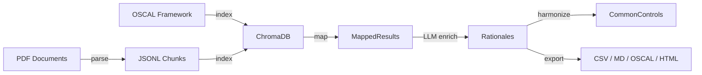

# ctrlmap

Privacy-preserving GRC automation CLI.

See the [README](https://github.com/JoshDoesIT/ctrlmap) for installation and quick start.

## Pipeline

## API Reference

- [Models](api/models.md) — Pydantic schemas and OSCAL parsing
- [Parse](api/parse.md) — PDF extraction and semantic chunking
- [Index](api/index.md) — Embeddings and vector store
- [Map](api/map.md) — Control mapping and LLM enrichment
- [LLM](api/llm.md) — Ollama client and structured output
- [Export](api/export.md) — Output formatters
